<p align="center">
  
</p>

<h1 align="center">gated-self-improvement</h1>

<p align="center">
  <b>Recursive self-improvement, measured with counterfactual controls.</b><br>
  LLM-free · pure-Python standard library · deterministic · every gain gated against a matched control.
</p>

<p align="center">
  <a href="https://sunghunkwag.github.io/research/gated-self-improvement/">Matched-compute results and limits</a> ·
  <a href="https://sunghunkwag.github.io/research/recursive-self-improvement/">What recursive self-improvement is, and how to test it</a>
</p>

<p align="center">
  <a href="https://deepwiki.com/sunghunkwag/gated-selfimprovement"></a>
</p>

<p align="center">
  <a href="LICENSE"></a>
  
  
  
</p>

---

## What this is

Most "recursive self-improvement" (RSI) projects **assert** a result. This one **measures**
it — and reports the nulls as loudly as the wins. Every claimed improvement must pass a
**counterfactual gate**: it has to help *at equal compute, on held-out tasks, with identical
random streams*, versus a matched control that is denied exactly the one mechanism under test.
No neural networks, no API calls — the engines are pure Python that runs offline and reproduces
bit-for-bit.

The animated banner above shows the one-picture idea: two arms run the **same** improvement
loop. The **GATED** arm may admit building blocks it discovers about itself; the **FROZEN** arm
cannot. The gap between them — never the raw number — is the evidence. (A fully interactive 3D
version — drag to orbit, click the result orbs — is in `index.html`; open it in any browser.)

## Results at a glance

**v3 upgrade (see [`results/UPGRADE_V3_RESULTS.md`](results/UPGRADE_V3_RESULTS.md)):** v3 targets v2's failed H2
(*an adaptive improver beats a frozen one*). A shared meta-predictor is trained on every paired counterfactual
outcome and carried across a sequence of 10 independent improvement problems. Result: in the pre-registered
go/no-go on fresh seeds, the meta-learned improver beat its frozen twin on unseen families (+1.35 of 240 tasks,
p = 0.023). The cross-problem carry-over, however, missed its pre-registered bar. The verdict was **NO_GO**, so the
confirmatory seeds were not run and v3's H2 remains **unconfirmed**.

**v2 upgrade (see [`results/UPGRADE_V2_RESULTS.md`](results/UPGRADE_V2_RESULTS.md)):** an audit found that v1's
held-out evaluation seeded each arm's search with the arm's own name, and that v1's one-round control saw 5×
fewer distinct tasks. The v1 compounding headline did not survive re-running. A new, preregistered,
compute-matched experiment (`src/rsi_v2`) was then run once on 300 fresh seeds.

| Experiment | Headline | Control | Status |
|---|---|---|---|
| **RSI v3: learning how to improve** (pre-registered go/no-go, n = 100 fresh seeds) | meta-learned improver vs frozen twin: **+1.35 tasks** of 240 on unseen families (CI [+0.05, +2.68]); its ranking predicts realized cross-family gain (Spearman +0.066, p < 1e-4), and the advantage grows over later problems | FROZEN_META (same code, tasks, streams, 4.4 M-execution cap) and ADAPTIVE_NOCARRY (predictor reset per problem) | **NO_GO**: cross-problem carry-over +0.53 (p = 0.22) missed its bar → confirmatory seeds 7001–7300 **untouched**; not a confirmed result |
| **RSI v2: recursive vs one-shot improvement** (preregistered H1) | 5 rounds beat 1 round at 5× compute on **unseen task families**: **+0.40 tasks** (95% CI [+0.10, +0.70]) | SINGLE_5X: same tasks, same attempt streams, same 610k-execution cap, stronger gate | **supported** (Holm p = 0.0098, n = 300); small effect |
| **RSI v2: adapting the improver itself** (preregistered H2) | adaptive improvement policy vs frozen policy: **−0.08** (CI [−0.35, +0.19]) | RECURSIVE_FROZEN: identical except the policy never learns | **null**; the compounding comes from recursion, not from learning how to improve |
| ~~Compounding RSI (v1 repaired mechanism)~~ | ~~+1.55 over 1 round at 5×~~ → **retracted**: with shared eval streams the chain is **below** the untrained baseline (−0.70, p = 0.0005), and a data-matched single round beats it (−0.59, p = 0.002) | COLD / R1PLUS_DM, n = 100 | **retracted by audit** |
| **MetaForge counterfactual** (full budget) | searcher self-upgrades v0→v3, solves **19 → 23** | frozen searcher: flat 19 for 8 waves | +21%, streams shared across arms; single deterministic stream (no seed variance) |
| **Open-ended loop** (4,444 generations) | **189** certified beyond-base behaviours | admission-disabled arm: **0**, forever | exact catalog membership |
| **Turing-complete substrate** (branches + loops) | **15** counterfactually-gated macros; solves held-out `reverse` | control arm: **0** macros | 8 seeds, offline VM |
| **Cross-substrate transfer** | a self-found skill unlocks a substrate that can't express it, **+2.00 tasks** | vs no-transfer and random-capability | **survives audit** (shared streams: p = 0.001; learning premium +1.00, p = 0.008; n = 60 extension +1.98 / +1.28, p < 1e-4) |
| **Gate integrity (SDT)** | maps the 3 ways a self-modifying gate fails | 4 ablation arms, n = 40 | collapse order survives audit; "ARB worst eval competence" withdrawn |

**Honest boundaries (also measured, not hidden):**

* **v2's positive result is small** (+0.40 of 24 tasks). It is specific to a synthetic domain whose task generator
  has a difficulty ladder by design, and it transfers to novel compositions of shared building blocks, not to
  unrelated domains.
* **Adapting the improvement process did not beat a frozen improvement policy** in v2, and its failure-mode
  context was inert. v3's meta-learned improver does beat its frozen twin in a pre-registered go/no-go look, but
  the gain is small (+2.3%). Its cross-problem component is not yet detectable on the final metric, and its
  diagnosis channel does not help the final metric, so it has **not** been confirmed.
* **Legacy v1 limits:** the meta-RL grid is a full null. Open-ended growth is linear, not accelerating, and
  eventually hits a *search-dilution* wall. Deep *composition* of a transferred skill is limited by its I/O
  interface.

## RSI v3 in one paragraph

A run is a sequence of 10 independent improvement problems. Each has a fresh TRAIN / META-VALIDATION / FINAL
family split, fresh tasks and a fresh base solver; only a shared ridge meta-predictor may carry from one problem to
the next. Each round the improver:

1. attempts its training tasks;
2. computes a continuous failure diagnosis;
3. generates a pool of structurally different edits, in proportions set by the diagnosis: mining, residual-guided
   repair mining, hierarchical composition, prior/order repair, exploration repair, and evidence-gated pruning;
4. **ranks the pool by predicted cross-family gain**;
5. tests the top candidates counterfactually against the incumbent on cross-family META-VAL probes, with paired
   streams;
6. adopts the winner;
7. trains the predictor on **every candidate × probe paired outcome**.

The FINAL holdout is sealed while any improver runs. Controls:
* FROZEN_META: identical, but the predictor never learns;
* ADAPTIVE_NOCARRY: predictor reset for each problem;
* NODIAG_META: diagnosis removed;
* SINGLE_COMPUTE_MATCHED: one round with 5× compute.

Every arm gets the same per-problem execution cap. A pre-written go/no-go criterion gates the confirmatory seeds.
It said NO_GO, and the seeds were left untouched.

## RSI v2 in one paragraph

Each round the system:

1. attempts its training tasks;
2. **diagnoses** why searches failed (missing operator, bad ordering, low exploration, over-specialisation,
   composition failure);
3. **chooses an improvement strategy** (mine behaviour-level macros, compose macros from macros, refit the prior,
   explore, prune, or a stacked combo);
4. builds a candidate solver and tests it **counterfactually**: screen on fresh probes, confirm on more fresh
   probes, same search streams as the incumbent;
5. **adopts or rolls back**;
6. **learns from the outcome**: strategy values per failure mode, strategy intensities, and delayed credit from
   whether the next round's new solves actually use what was adopted.

Every program execution is metered against one cap shared by all arms and cross-checked against a global
counter. Holdout tasks come from external families behind a tripwire. The evaluator, task manifests,
hyperparameters, seeds, metric and statistics were hash-frozen in an append-only ledger and pushed (`62cbfe2`)
before the single confirmatory run. 40 executable anti-cheat tests guard against hidden compute, condition-specific
RNG, leakage, memorisation, evaluator edits, hard-coded answers, weakened criteria, deleted runs, and counting
self-generated tasks.

## The core discipline

- **Counterfactual gating** — a mechanism is credited only if an otherwise-identical arm that
  lacks it does worse, at equal budget and identical PRNG streams.
- **Held-out evaluation** — tasks the improver never trained on; source/target pool splits.
- **Pre-registration + honest nulls** — predictions written before runs; negative and
  noise-floor results reported alongside positives.
- **Machine-checkable certificates** — novelty is exact set-membership against an enumerated
  behaviour catalog; ledgers are hash-chained; everything is deterministic and resumable.

## Quick start

```bash
# no dependencies — Python 3.8+ standard library only
python3 -m unittest discover -s tests -v          # v2 + v3 anti-cheat suites (~1-2 min)
(cd src && python3 -m rsi_v2 verify && python3 -m rsi_v2 report)   # frozen v2 verdict from the ledger
(cd src && python3 -m rsi_v3 verify)              # v3 ledger chain (go/no-go was NO_GO; not frozen)
python3 experiments/v3_devcheck_analysis.py v3devcheck-01-dev10config   # v3 go/no-go tables (read-only)
python3 experiments/audit_v1_rerun.py report       # v1 audit: old vs shared eval streams
python3 experiments/v2_analysis.py confirm         # v2 mechanism tables (post hoc)
python3 src/tforge.py selftest              # VM: branches, loops, halting, crash-safety
python3 src/transferforge.py run 1 11 300   # cross-substrate transfer (n=11)
python3 src/transferforge.py report
python3 src/omniforge.py selftest           # unified model: 4 engines on one substrate
python3 src/omniforge.py upgrade report2    # compounding-RSI battery report
```

Long-horizon batteries run on any free CPU box (or the Kaggle kernels
`experiments/kaggle/*_kaggle.py` / `experiments/kaggle/omniforge_full_battery.py`) — all offline, no GPU.

## Key files

| File | Role |
|---|---|
| `src/omniforge.py` | unified model: shared substrate + 4 search engines + meta-RL + RSI upgrade + a separate stack-VM RSI system |
| `src/tforge.py` | Turing-complete substrate (branches, data-dependent loops) |
| `src/openforge.py` | open-ended improvement loop (vocabulary growth + self-curriculum) |
| `src/transferforge.py` | cross-substrate skill transfer experiment |
| `src/rsi_v2/` | **v2**: adaptive improver, compute-matched arms, frozen tasks/evaluator, ledger, runner (`python3 -m rsi_v2`) |
| `src/rsi_v3/` | **v3**: meta-learned improver (shared contextual predictor, 6 structurally distinct actions), 3-way family split with sealed final holdout, locked ledger, runner (`python3 -m rsi_v3`) |
| `tests/test_v3_anticheat.py` | v3 anti-cheat defenses (25 tests) |
| `results/UPGRADE_V3_RESULTS.md` | v3 design, full dev history (incl. rejected designs), go/no-go (NO_GO), verification checks, limitations |
| `results/ledger/rsi_v3_ledger.jsonl`, `results/v3_devcheck_report.json` | v3 hash-chained ledger; go/no-go analysis |
| `tests/test_v2_anticheat.py` | executable anti-cheat defenses (40 tests) |
| `results/UPGRADE_V2_RESULTS.md` | v2 audit + design + preregistration + confirmatory results + limitations |
| `results/PREREGISTRATION_V2.json`, `results/ledger/rsi_v2_ledger.jsonl` | frozen protocol; hash-chained ledger of every dev/confirm run |
| `experiments/audit_v1_rerun.py` | v1 XV2 re-run with shared vs arm-keyed eval streams + data-matched control |
| `src/rsi_upgrade.py` | the v1 "repaired" compounding mechanism (claim retracted by the v2 audit) |
| `src/sdt_layer.py` | reflective-endorsement / gate-integrity experiment |
| `index.html` | the interactive 3D demo (open locally in any browser) |
| `results/*_RESULTS.md` | per-experiment write-ups; `results/logs/experiments_log.jsonl` raw records |
| `wiki/Home.md` … `wiki/FAQ.md` | wiki pages (architecture, methodology, reproducing, FAQ) |

## How to read a claim here

Pick any headline. Find its `results/*_RESULTS.md`. It will tell you: the exact contrast, the control it
was measured against, the budget both arms shared, the seed count, the permutation p-value, and
the boundary of what it does *not* show. If a claim can't survive that, it isn't in the table.

## License

[Apache-2.0](LICENSE). © 2026 Sung Hun Kwag. LLM-free by design; contributions welcome via issues/PRs.
